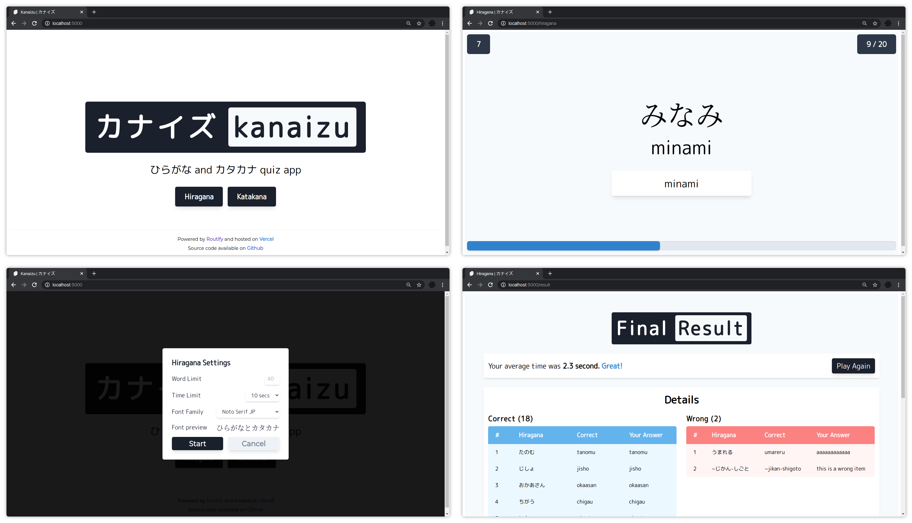

# Kanaizu

This is a simple quiz app that I made as an excuse to try Routify/Svelte and to help my friend memorise Japanese kana. It's not perfect but it's quite usable. Currently there are ~508 words or phrase of hiragana and katakana.

I got the name **Kanaizu** by combining **Kana** and **Quiz**. Yeah, it might sound stupid but meh, I never good at naming stuff so it is what it is.

> This app is not responsive because I only intend to use this on desktop, typing on a phone is such a pain. Therefore it is pointless for me to make it responsive.

## Preview


The site is available [here](https://kanaizu.vercel.app)

## Build
To build this app, run this command

```bash
npm run build
```
## Develop
If you want to add some features to this app, you can run these commands

```bash
npm run dev # using rollup
npm run dev:nollup # using nollup, super fast rebuild
```

# License

MIT © [Elianiva](https://github.com/elianiva/kanaizu/blob/master/LICENSE)
